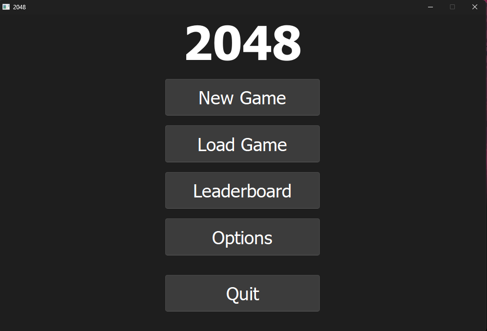
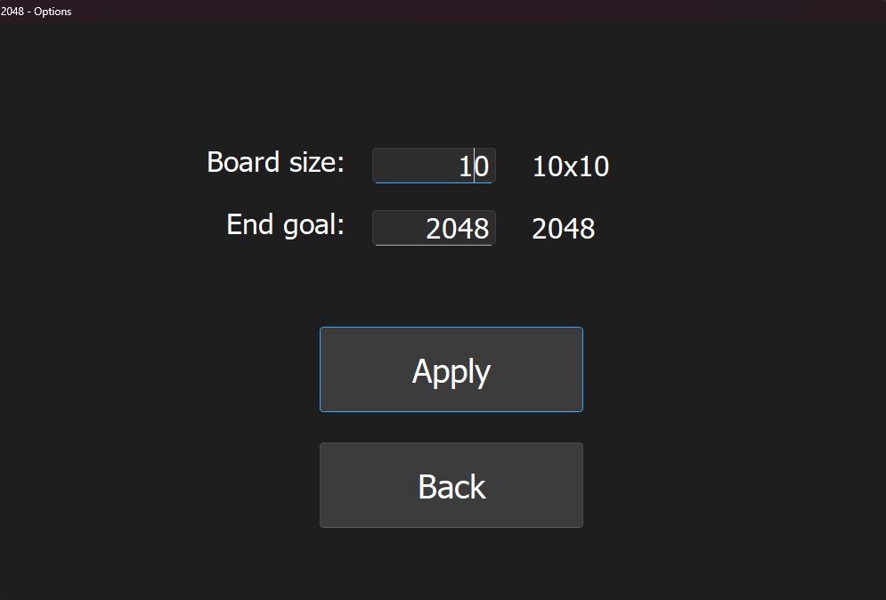
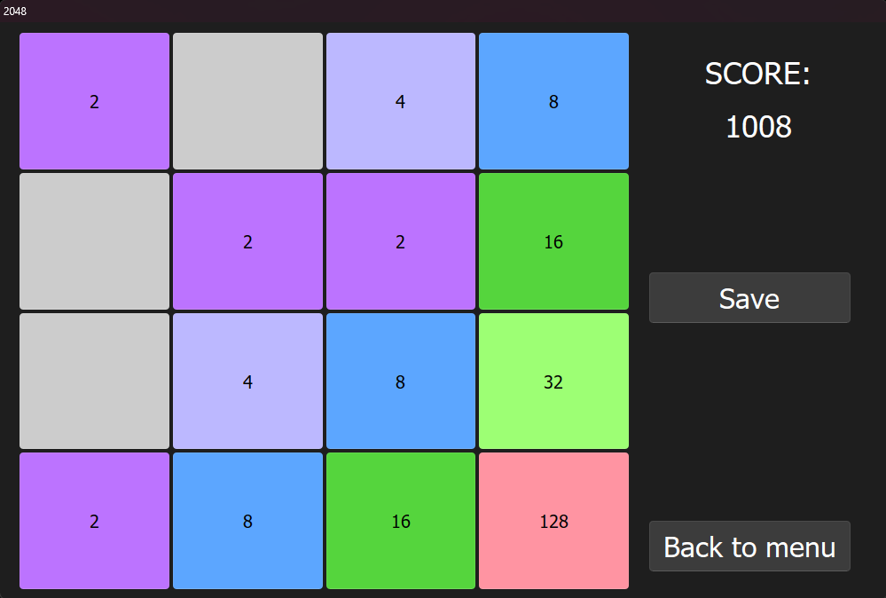
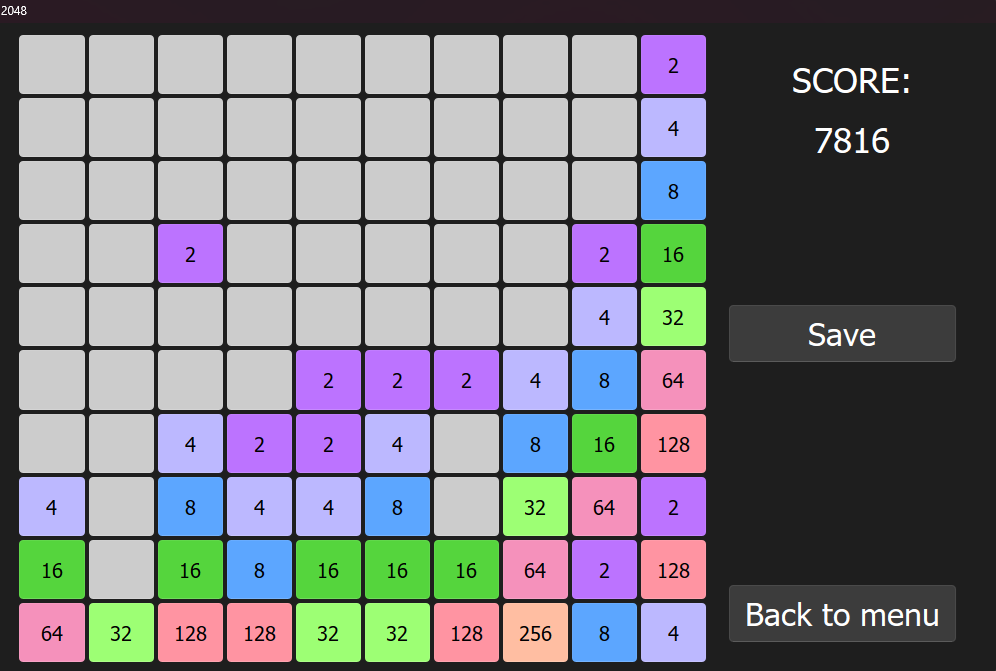

# 🎮 2048 Game (Qt C++)

A simple implementation of the classic **2048** puzzle game written in **C++ using the Qt framework**.
This version expands upon the original by adding features such as **saving and loading games** and **customizable board sizes**.

## ✨ Features
-  Classic 2048 gameplay
-  Save and load your game progress
-  Adjustable grid size (e.g., 3x3, 4x4, 5x5, etc.)
-  Scores and leaderboard
-  Simple and intuitive Qt-based GUI
-  Keyboard arrow controls for smooth gameplay

## 🚀 How to Run
1. Clone this repository:
   ```bash
   git clone https://github.com/Fenisk/2048
   ```
2. Open the project in Qt Creator.
3. Build the project in Release mode.
4. Run the executable.

## 🛠 Technologies
- C++
- Qt 5 Framework
- Qt Widgets
- Object-Oriented Programming (OOP) principles

## 📸Screenshots
*Main menu*

*Options*

*Classic 4x4 gameplay*

*10x10 size*

